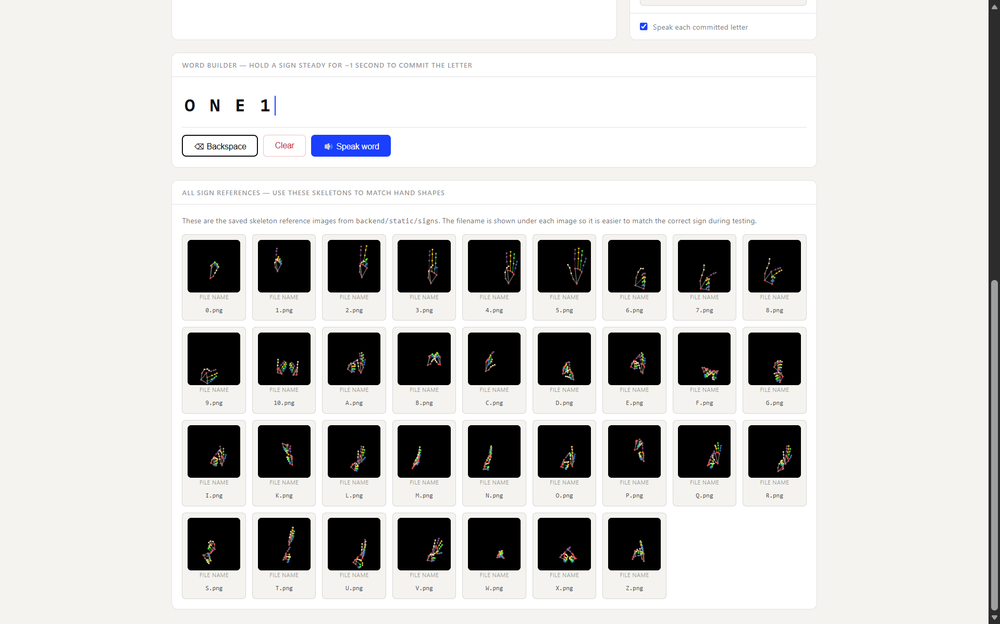

# NZSL Fingerspelling Recognition — Privacy-Preserving Keypoint System

[](https://codespaces.new/harmandeeppal/nzsl-fingerspelling-recognition?devcontainer_one_click=true)

Privacy-preserving, real-time New Zealand Sign Language (NZSL) and British Sign Language (BSL) fingerspelling recognition system. 

Rather than processing raw webcam frames, this system extracts 21 hand skeleton keypoints using **MediaPipe Hands**, immediately discards the raw visual frame, and performs classification on a scale-invariant 508-dimensional pose vector. One-hand and two-hand signs are processed using independent model branches and routed automatically at inference.

---

<!-- 
  NOTE FOR YOUTUBE:
  Replace "YOUR_VIDEO_ID" below with your actual YouTube video ID (e.g. dQw4w9WgXcQ)
-->
<p align="center">
  
</p>

<p align="center">
  <a href="https://www.youtube.com/watch?v=YOUR_VIDEO_ID">
    
  </a>
</p>

---

## Table of Contents

1. [Project Overview](#1-project-overview)
2. [Achieved Experimental Results](#2-achieved-experimental-results)
3. [Project Structure](#3-project-structure)
4. [Quick Start — Running the Demo](#4-quick-start--running-the-demo)
   - [4.1 Hugging Face Token Configuration](#41-hugging-face-token-configuration)
   - [4.2 Windows Bootstrap](#42-windows-bootstrap)
   - [4.3 Linux / Codespaces Bootstrap](#43-linux--codespaces-bootstrap)
5. [Manual Setup](#5-manual-setup)
6. [Hugging Face Checkpoints Integration](#6-hugging-face-checkpoints-integration)
   - [6.1 Model Resolution Manifest](#61-model-resolution-manifest)
   - [6.2 Deploying / Uploading Checkpoints](#62-deploying--uploading-checkpoints)
7. [Directory Cleanup & Output Reorganization](#7-directory-cleanup--output-reorganization)
8. [Troubleshooting](#8-troubleshooting)

---

## 1. Project Overview

This project consists of an end-to-end pipeline covering dataset download, face/hand feature extraction, model training, evaluation, and real-time inference:

- **Stage 1 (Feature Extraction)**: Uses MediaPipe to convert 34,000 images from the BSL alphabet and numbers dataset into a scale-invariant, wrist-normalised 508-dimensional keypoint vector (254 dimensions per hand slot, zero-padded if a hand is missing).
- **Stage 2 (Routing & Multi-Branch Classification)**: Automatically routes the pose vector to a specialist one-hand or two-hand model branch depending on whether one or two hands are active in the keypoint data.
- **Stage 3 (Real-Time Web Server)**: A FastAPI backend serves the frontend webpage and loads the trained classifiers (SVM, Random Forest, k-NN, sklearn MLP, and Keras MLP) to run inference in real-time on webcam keypoint coordinates.

---

## 2. Achieved Experimental Results

Five classifiers were evaluated on a held-out test partition (15% stratified split) and compared against a raw-pixel SVM baseline (trained on $64\times64$ greyscale images with PCA):

| Model | One-Hand Test Accuracy | One-Hand Test F1 | Two-Hand Test Accuracy | Two-Hand Test F1 |
|---|---|---|---|---|
| **SVM (RBF)** *(Best overall)* | **99.87%** | **99.87%** | **99.84%** | **99.84%** |
| Random Forest | 99.75% | 99.75% | 99.80% | 99.80% |
| k-NN | 99.81% | 99.81% | 99.69% | 99.69% |
| Sklearn MLP | 99.87% | 99.87% | 99.65% | 99.65% |
| Keras MLP | 99.75% | 99.75% | 98.94% | 98.94% |
| *Raw-pixel SVM Baseline* | *96.33%* | *96.33%* | *96.33%* | *96.33%* |

> [!NOTE]
> The keypoint-based SVM outperformed the raw-pixel baseline by **~3.5 percentage points** while requiring no raw image storage at inference time, proving that eliminating personal visual features (skin tone, lighting, background) increases model performance.

---

## 3. Project Structure

```text
nzsl-fingerspelling/
│
├── backend/
│   ├── static/
│   │   └── signs/                    ← Skeleton reference images (one PNG per class)
│   ├── nzsl_api.py                   ← FastAPI web server & HF bootstrap downloader
│   └── requirements.txt              ← Backend API dependencies
│
├── checkpoints/                      ← Ignored by git, downloaded on server start
│   ├── *.joblib                      ← Scikit-learn models (SVM, RF, k-NN, MLP)
│   ├── *.h5                          ← Keras neural network weights
│   ├── *.pkl                         ← Keras MinMaxScaler scalers
│   ├── *.npy                         ← Class name arrays
│   └── model_results.json            ← Tabular accuracy results
│
├── notebook/
│   ├── nzsl_fingerspelling_pipeline.ipynb  ← Hand extraction + training notebook
│   └── visuals_generation.ipynb            ← Comparison plots & visual helper notebook
│
├── outputs/                          ← Reorganized pipeline output artifacts
│   ├── data/                         ← dataset.csv (508-dim cache)
│   ├── results/                      ← Metric CSVs, txt reports, comparison tables
│   └── figures/                      ← Reorganized plots, histories, confusion matrixes
│
├── screenshots/                      ← Dashboard preview screenshots for README
│   ├── Health.png
│   ├── Models.png
│   └── Signs_List.png
│
├── latex/
│   ├── figures/                      ← LaTeX report figures (image1.png - image7.png)
│   └── COMP820_Report-2.tex          ← IEEEtran conference report
│
├── scripts/
│   └── upload_checkpoints.py         ← Script to push checkpoints to Hugging Face
│
├── bootstrap.ps1                     ← Windows bootstrap launch script
├── bootstrap.sh                      ← Linux / Codespaces bootstrap launch script
├── environment.yml                   ← Conda environment configuration
├── model_manifest.json               ← Resolves checkpoints on Hugging Face model hub
├── nzsl_frontend.html                ← Live web dashboard UI
├── .env.example                      ← Template environment variables
└── README.md                         ← This file
```

---

## 4. Quick Start — Running the Demo

Model checkpoints are hosted on the Hugging Face Model Hub. If checkpoints are missing locally, they download automatically on the first server start.

### 4.1 Hugging Face Token Configuration

If the Hugging Face model repository is **private**, you must configure a token with READ access.

1. Get a token at [huggingface.co/settings/tokens](https://huggingface.co/settings/tokens)
2. Create a `.env` file in the project root:
   ```ini
   HF_TOKEN=hf_xxxxxxxxxxxxxxxxxxxx
   ```
   *Alternatively, if no `.env` file is present and checkpoints are missing, the bootstrap script will prompt you to enter the token in the terminal and write it to `.env` for you.*

---

### 4.2 Windows Bootstrap

Run the PowerShell bootstrap script from the project root:

```powershell
.\bootstrap.ps1
```

*If execution policies block the script, bypass them for this terminal session using:*
```powershell
Set-ExecutionPolicy -Scope Process -ExecutionPolicy Bypass
```

**What it automates:**
1. Creates the `nzsl-env` conda environment from `environment.yml` (first run only).
2. Installs the backend FastAPI requirements into `nzsl-env`.
3. Loads `.env` file variables.
4. Starts the FastAPI server on port `8000`. Missing checkpoints download automatically from Hugging Face on startup.

Access the UI at: **[http://localhost:8000](http://localhost:8000)**

---

### 4.3 Linux / GitHub Codespaces Bootstrap

Run the bash bootstrap script from the project root:

```bash
chmod +x bootstrap.sh
./bootstrap.sh
```

**Accessing from Codespaces**:
GitHub Codespaces will automatically forward port `8000`. Click the "Open in Browser" button in the pop-up or open port 8000 under the **Ports** tab of your editor.

---

## 5. Manual Setup

If you prefer to configure the environment manually without the bootstrap scripts:

```bash
# 1. Create and activate environment
conda env create -f environment.yml
conda activate nzsl-env

# 2. Install backend API requirements
pip install -r backend/requirements.txt

# 3. Set Hugging Face token (if repository is private)
export HF_TOKEN="hf_xxxxxxxxxxxxxxxxxxxx" # Linux/macOS
# or
$env:HF_TOKEN = "hf_xxxxxxxxxxxxxxxxxxxx" # Windows PowerShell

# 4. Start the server
uvicorn backend.nzsl_api:app --host 0.0.0.0 --port 8000
```

---

## 6. Hugging Face Checkpoints Integration

Checkpoints are completely ignored by Git and removed from GitHub to keep the repository lightweight. Instead, the backend API downloads them from Hugging Face on demand.

### 6.1 Model Resolution Manifest

On startup, `backend/nzsl_api.py` checks `model_manifest.json` for model resolution paths. If any of the files in `checkpoints/` are missing, the server calls `huggingface_hub.hf_hub_download` using the `HF_TOKEN` environment variable:

```json
{
  "repo_id": "harmandeeppal/nzsl-fingerspelling-recognition",
  "revision": "main",
  "files": [
    "svm_rbf_one_hand.joblib",
    "svm_rbf_two_hand.joblib",
    ...
  ]
}
```

---

### 6.2 Deploying / Uploading Checkpoints

If you train new models and want to deploy them to the Hugging Face Hub:

1. Obtain a Hugging Face token with **WRITE** access.
2. Make sure your trained model checkpoints are in the `checkpoints/` folder.
3. Run the upload script:
   ```bash
   python scripts/upload_checkpoints.py
   ```
4. Enter your write access token when prompted. The script will automatically create/verify the repository and push all files listed in `model_manifest.json`.

---

## 7. Directory Cleanup & Output Reorganization

The project output files are organized into dedicated subdirectories under `outputs/`:
- `outputs/data/` houses cache database files (`dataset.csv`).
- `outputs/results/` houses metric CSV tables and classification report TXT files.
- `outputs/figures/` houses visual charts, confusion matrices, and training histories.

The root `figures/` directory has been removed, and all LaTeX-specific figures (e.g. `image1.png` - `image7.png` used by `COMP820_Report-2.tex`) are stored inside `latex/figures/` to keep the root directory clean. The LaTeX compiler compiles correctly because the document preamble contains:
```latex
\graphicspath{{figures/}{latex/figures/}}
```

---

## 8. Troubleshooting

### `ModuleNotFoundError: No module named 'huggingface_hub'`
You need to install the backend dependencies. Run the bootstrap script or manually install:
```bash
pip install -r backend/requirements.txt
```

### API returns `no_models_loaded` status
Verify that `checkpoints/` contains the required files or that your `HF_TOKEN` in `.env` is correct. Check terminal logs for any network errors while the server was attempting to connect to Hugging Face.

### Sign reference panel is empty in web UI
The backend references reference PNG files under `backend/static/signs/` to render skeletons. If this directory is empty, rerun the visuals generation notebook to regenerate reference images.

---
*Last updated: May 2026*
